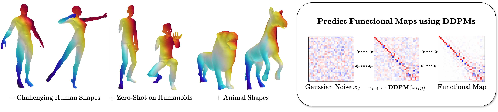
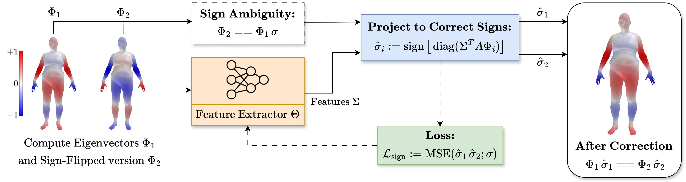
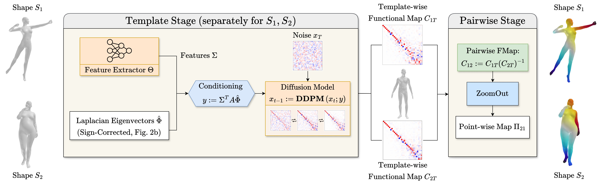

# [CVPR 2025] Denoising Functional Maps: Diffusion Models for Shape Correspondence

*Aleksei Zhuravlev*, *Zorah Lähner*, *Vladislav Golyanik*

### [Project Page](https://alekseizhuravlev.github.io/denoising-functional-maps/) | [Paper](https://arxiv.org/pdf/2503.01845) | [Data](https://drive.google.com/drive/folders/1_lb59YmxMGUpPeqKwHBwEAag_UhQoi24?usp=sharing)




## Installation

The installation should be automatic, the main dependencies are PyTorch, Diffusers, Accelerate, and mesh processing libraries.

```bash 
conda create -n denoisfm python=3.12
conda activate denoisfm
pip install -r requirements.txt --no-cache-dir
```

## Data and Checkpoints

In this [Google Drive](https://drive.google.com/drive/folders/1_lb59YmxMGUpPeqKwHBwEAag_UhQoi24?usp=sharing) folder you can find:
- `checkpoints` - pretrained models for the DDPM and the sign correction network
- `data/test` - test datasets with ground truth correspondences
- `data/train` - *(optional)* train datasets for the DDPM and the sign correction network.
- `results` - *(optional)* precomputed point-to-point correspondences obtained by our models for the test datasets.

Download the `checkpoints` to the root of the repository. The `data` directory can be placed anywhere on your machine.

## Inference on Your Meshes

Given a pair of meshes, you can obtain the point-to-point correspondence using the pretrained model:

```python
python test_on_custom_pair.py --exp_name ddpm_64 --checkpoint_name epoch_99 --shape_1 data/example/off/tr_reg_082.off --shape_2 data/example/off/tr_reg_096.off
```

The resulting map will be saved to `results/ddpm_64/custom_pair/shape_1_shape_2.pt`. To visualize the correspondence using color transfer, check `visualize_correspondence.ipynb`.


*Tip:* the inference of DDPM takes some time. If you would like to speed it up, you can change the `"inference"` parameters in the `config.yaml` file:

- Reduce the total number of sampled functional maps per shape (`"num_samples_total"`) and the amount used for the Dirichlet energy-based selection (`"num_samples_selection"`) to e.g. 64-10, 32-5. 
- Increase the ZoomOut step to e.g. 2, 4, 8.

This will slightly affect the correspondence accuracy.


## Inference on Test Datasets

You can evaluate the pretrained models on standard shape correspondence benchmarks. First, compute the spectral operators and geodesic distance matrices for the dataset (the latter take 100-250 MB per shape):

```python
python preprocess.py --data_root path/to/FAUST_r

# scripts/preprocess_datasets.sh to preprocess all datasets
```


Then, run the inference on the test dataset:

```python
python test_on_dataset.py --exp_name ddpm_64 --checkpoint_name epoch_99 --dataset_name FAUST_r --data_dir path/to/data/test

# scripts/test_ddpm.sh to test on all datasets
```

The results will be saved to `results/ddpm_64/FAUST_r`.
To calculate the per-category error for DT4D and SMAL, check `category_err_DT4D_SMAL.ipynb`.

Again, you can visualize the maps using `visualize_correspondence.ipynb`.


## Test the Sign Correction

Evaluate the accuracy of the sign correction network on the test datasets (Supplementary A.1):

```python
python test_sign_net.py --exp_name sign_net_64 --checkpoint_name 50000.pth --dataset_name FAUST_r --data_dir path/to/data/test --n_epochs 100

# scripts/test_sign_net.sh to test on all datasets
```


## Training

Our model consists of two components: the sign correction network and the DDPM. The sign net is fast to train and can be used as a standalone tool. The DDPM requires a lot of computational resources.

### 1. Sign Correction Network




Resolves the sign ambiguity of eigenvectors of the Laplacian. The learned features are used as conditioning for the DDPM. The sign-corrected eigenspace likely has other interesting properties, so feel free to use it for your own applications.

#### 1.1. Generate ~1000 training meshes 

The datasets that were used to train our models are available in the `data/train/sign_net` directory. 
If you would like to create your own data, use `denoisfm/data_generation/generate_meshes.py`.

To generate SMAL meshes (Section 5.5), use `denoisfm/data_generation/vary_poses_smal.ipynb`.

#### 1.2. Training

Check the `train_sign_net.py` and modify the config dictionary to your needs. Then run it with the necessary arguments. The training takes less than one hour on a single GPU.


### 2. DDPM



Predicts the template-wise functional map using the sign-corrected eigenvectors and the features learned by the sign net. 

#### 2.1. Generate a large dataset of sign-corrected functional maps and conditioning

Once you have trained the sign correction network, use it to create a training dataset for DDPM.
This consists of the following steps:

1. Take a shape from SURREAL or SMAL
2. Remesh it
3. Compute the Laplacian and the eigenvectors
4. Apply the sign correction network to the eigenvectors of the target shape $\Phi_1$ and the template shape $\Phi_T$
5. Compute the functional map to the template shape $C_{1T}$ using the corrected eigenvectors $\hat{\Phi}_T, \hat{\Phi}_1$
6. Compute the conditioning matrices $y_T$ and $y_1$ for the template and the target shape
6. Save $C_{1T}$, $y_T$, and $y_1$.

The pipeline is implemented in `denoisfm/data_generation/generate_fmaps.py`, check the config dictionary and the arguments. 
The code is intended to be run on a cluster as an array job, the SLURM script is provided in `scripts/generate_fmaps_slurm.sh`. The typical runtime is 3-4 seconds per shape, we use 230k shapes for SURREAL and 64k for SMAL.

To combine the data generated by the processes, use `denoisfm/data_generation/gather_fmaps.py`.


#### 2.2. Training

The training is identical to the conditional generation of images. It is implemented in `train_ddpm.py`, check the config dictionary and the arguments. The training is intended to be run on a cluster with multiple GPUs, the SLURM script is provided in `scripts/train_ddpm_slurm.sh`.

On 8 GPUs, the training time is 1, 8, and 30 hours for the 32, 64, and 96 dimensional models, respectively. It is possible to train the model on a single GPU as well.


## Contact

Feel free to use our work as a baseline for shape correspondence tasks!
For questions or technical assistance, contact [Aleksei Zhuravlev](https://alekseizhuravlev.github.io/).

```bibtex
@inproceedings{zhuravlev2025denoisfm, 
    title={Denoising Functional Maps: Diffusion Models for Shape Correspondence},
    author={Zhuravlev, Aleksei and L{\"a}hner, Zorah and Golyanik, Vladislav},
    booktitle={Computer Vision and Pattern Recognition (CVPR)},
    year={2025}
}
```


